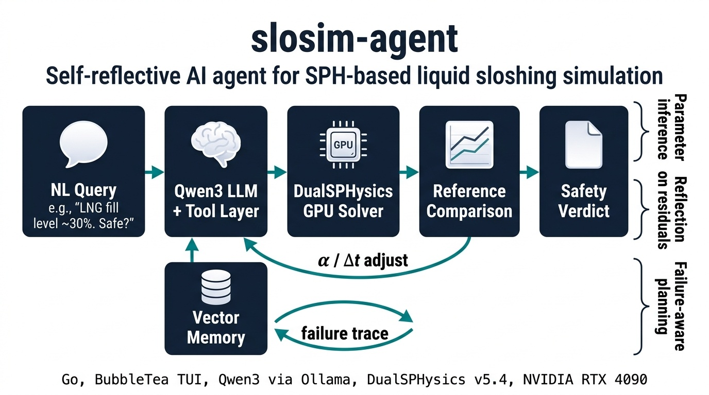
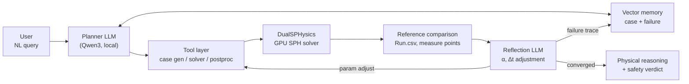

# slosim-agent

> **Autonomous AI agent for SPH-based liquid sloshing simulation.**
> From a natural-language query to a validated SPH solution,
> with self-reflective parameter tuning against reference data.

<p>
  
  
  
  
  
  
</p>



---

## What it does

Field operators of large liquid-storage tanks rarely know SPH terminology
or sloshing-analysis workflows. `slosim-agent` lets them ask in plain
language, runs the simulation autonomously, and returns a physics-grounded
answer.

**Example query (LNG tank operator, in Korean):**

> "100-76번 탱크 운영 관리자임. 지금 탱크에 LNG 가스가 30% 정도
>  차 있는데, 내일자 운영 계획에 따라 안전 운행이 가능하니?"

**Example query (English, equivalent):**

> "I operate tank 100-76. Current LNG fill level is about 30%.
>  Given tomorrow's operating schedule, is safe transit possible?"

**Agent flow:**

1. **NL → simulation parameters.** The agent infers tank geometry, fluid
   properties, and excitation conditions from the query, augmenting
   context with retrievals from the case-and-failure memory.
2. **Case generation + GPU SPH execution.** A DualSPHysics XML case is
   built and run on GPU (RTX 4090 reference target).
3. **Reflection on residuals.** Solver output (`Run.csv`, measure points)
   is compared against reference data; the agent reasons about residuals
   and proposes adjustments to artificial-viscosity coefficient `α` and
   timestep `Δt`.
4. **Physical reasoning + safety verdict.** Once converged, the agent
   returns a Markdown report with visualizations and a domain-grounded
   safety judgment.

---

## Why this is not just an LLM wrapper

The LLM in `slosim-agent` performs three categories of judgment that go
beyond plain tool-calling. Pure orchestration (file IO, solver invocation,
result parsing) is explicitly factored into a tool layer.

| Capability | What the LLM actually does | Beyond plain tool-calling | Code evidence |
|---|---|---|---|
| **Parameter inference** | Maps NL intent to simulation inputs (`dp`, `fill_height`, `amplitude`, BCs) | Augments context with retrievals from a case-and-failure memory layer (designed in architecture) before inference | [`internal/llm/prompt/sloshing_coder.go`](./internal/llm/prompt/sloshing_coder.go) — parameter-decision rules |
| **Reflection on residuals** | Reads `Run.csv` and reference data, reasons about residuals in physical terms, proposes `α`/`Δt` updates | Not a fixed threshold check — natural-language reasoning over convergence behavior and reference mismatch | [`internal/llm/tools/monitor.go`](./internal/llm/tools/monitor.go) (MON-01), [`internal/llm/tools/analysis.go`](./internal/llm/tools/analysis.go) (RPT-03) |
| **Failure-aware planning** | Recalls past failure traces by semantic similarity and steers around them | Not just inspecting the latest tool result — embedding-based recall over the agent's own history | [`internal/llm/tools/error_recovery.go`](./internal/llm/tools/error_recovery.go) (NFR-01) |

Detailed design: [ARCHITECTURE.md](./ARCHITECTURE.md) ·
Agent definitions: [AGENTS.md](./AGENTS.md) ·
Product requirements: [PRD.md](./PRD.md).

---

## Architecture



Layered view: TUI (BubbleTea) → Agent core (Qwen3 + tool loop) →
DualSPHysics tool surface (15 tools) → SPH solver + ParaView post-processing.
Full layout in [ARCHITECTURE.md](./ARCHITECTURE.md).

---

## Results

Validated against published SPH sloshing benchmarks. Numeric results below
are taken from the `paper-pof` track outline; figures are from the
`paper/figures/` curation.

| Benchmark | Reference | Metric | Error |
|---|---|---|---|
| SPHERIC Test 10 — Oil | Botia-Vera et al. (2010) | Peak pressure | <!-- TODO: confirm against paper-pof draft --> 26.4% |
| SPHERIC Test 10 — P2 sensor | Delorme et al. (2009) | Peak pressure | <!-- TODO: confirm --> 4.8% |
| Bridge experiment | 5 physical criteria | Pass rate | <!-- TODO: confirm --> 5 / 5 |
| Baffle parametric study | Optimal `α` recovery | Deviation | <!-- TODO: confirm --> 28.5% |

<!-- TODO: inline pressure_comparison_run001_002_exp.png and convergence_study.png from paper/figures/ once branch is merged or images are copied to docs/results/ -->

---

## Research artifacts

This repository is the codebase behind two ongoing papers and four
research iterations.

| Track | Branch | Focus |
|---|---|---|
| **Paper 1 (Verification, CS)** | [`paper-cs`](https://github.com/kimimgo/slosim-agent/tree/paper-cs) | Agent architecture, 15-tool surface, M-A3 parameter-fidelity metric, factorial ablation, cross-model 5×10. <!-- TODO: confirm target venue --> |
| **Paper 2 (Validation, PoF)** | [`paper-pof`](https://github.com/kimimgo/slosim-agent/tree/paper-pof) | Quantitative validation of agent-generated SPH cases against SPHERIC T10, Rafiee 2011, and a bridge experiment. Target: *Computational Particle Mechanics* (Springer). |
| Legacy combined draft | [`paper`](https://github.com/kimimgo/slosim-agent/tree/paper) | Initial unified manuscript (`drafts/v1_paper.pdf`), now split into the two tracks above. |

Research iteration trail (try-and-error history, separated from `main`):

| Branch | Scope |
|---|---|
| [`research-v1`](https://github.com/kimimgo/slosim-agent/tree/research-v1) | Closed. Initial baseline. |
| [`research-v2`](https://github.com/kimimgo/slosim-agent/tree/research-v2) | SPHERIC T10 baseline runs, first paper figures. |
| [`research-v3`](https://github.com/kimimgo/slosim-agent/tree/research-v3) | EXP-A (parameter fidelity, 10 scenarios × 2 models × 3 trials), EXP-B (2×2 factorial ablation), EXP-C (oil 2D parametric, ρ × α, 13 cases), EXP-D (SWL comparison). |
| [`research-v4`](https://github.com/kimimgo/slosim-agent/tree/research-v4) | Active. Cross-model experiment (5 models × 10 scenarios) and code fixes. |

---

## Quick start

Reference target: NVIDIA RTX 4090 (sm_89, CUDA 12.6) on Linux with Docker
and the NVIDIA Container Toolkit. A local Ollama instance serves the LLM.

```bash
# 1. Pull the LLM (Qwen3-32B with 64k context)
ollama pull qwen3:32b
# Optional: load the project's tuned modelfile
ollama create qwen3-32b-64k -f Modelfile.qwen3-32b-64k

# 2. Build the DualSPHysics GPU container
docker compose build

# 3. Build the agent binary (CGO disabled, stripped)
CGO_ENABLED=0 go build -ldflags "-s -w" -o slosim ./main.go

# 4. Run a non-interactive query
./slosim -c . -p "100-76번 탱크 LNG 30%, 내일 운행 안전한가?" -q -f json

# 5. Or launch the interactive TUI
./slosim
```

Configuration lives in `.opencode/config.json`. The `LOCAL_ENDPOINT`
environment variable points the agent at the Ollama host (default
`http://localhost:11434`).

---

## Tech stack

| Layer | Technology |
|---|---|
| Agent runtime | Go 1.24, BubbleTea TUI (forked from OpenCode) |
| LLM | Qwen3-32B / Qwen3-Coder, served locally via Ollama |
| Physics solver | DualSPHysics v5.4 (GPU, CUDA 12.6) |
| Post-processing | `pvpython` (ParaView CLI), headless rendering |
| Persistence | SQLite (`sqlc`-generated), `goose` migrations |
| Memory layer | Vector store for case + failure recall (designed in architecture, see ARCHITECTURE.md §Memory) |
| Integrations | Model Context Protocol (`.mcp.json`), OpenCode config (`.opencode.json`) |
| Release | GoReleaser (multi-platform), Docker (`Dockerfile`, `Dockerfile.pvpython`) |

---

## Roadmap

- [x] SPH sloshing PoC (research v1 → v3)
- [x] Reflection-based autonomous parameter tuning (`α`, `Δt`)
- [x] Failure-aware planning architecture (case + failure memory)
- [x] Cross-model evaluation (5 models × 10 scenarios, research v4)
- [ ] Multi-agent orchestration (master + sub-agents) for concurrent
      parametric studies
- [ ] **General-purpose SPH agent for scientific simulation** —
      The reflection loop and failure-memory design are domain-agnostic.
      With a swap of reference data and case templates, the same
      architecture extends to other SPH problem classes (multiphase
      free-surface flow, fluid-structure interaction, granular flow,
      materials processing). The solver remains DualSPHysics-class SPH.

Per-version feature plans will be tracked in subsequent releases.

---

## License

MIT
